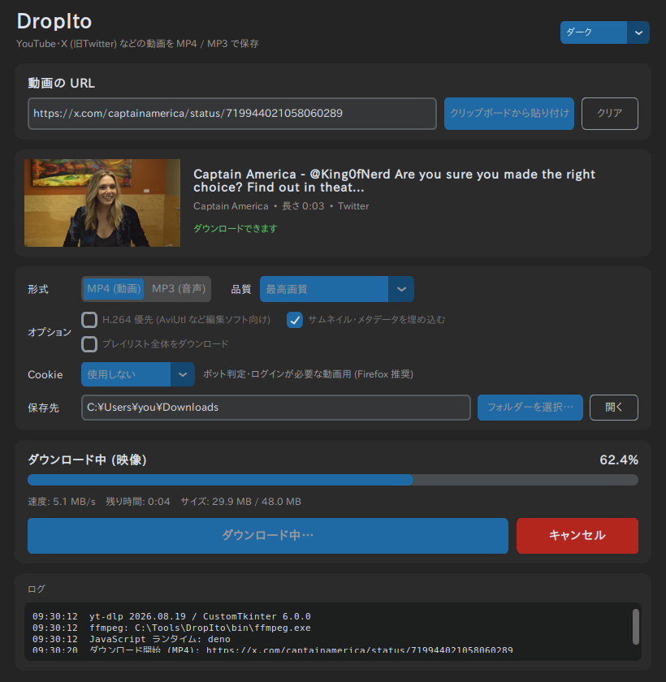

# DropIto

YouTube や X (旧Twitter) などの URL を貼り付けるだけで、動画を **MP4**、音声を **MP3** で保存できる Windows 向けデスクトップアプリです。
ダウンロードエンジンは [yt-dlp](https://github.com/yt-dlp/yt-dlp) と ffmpeg、画面は [CustomTkinter](https://github.com/TomSchimansky/CustomTkinter) (ダークモード対応) で作っています。



## 主な機能

- URL 入力欄と「クリップボードから貼り付け」ボタン (右クリックメニュー、Enter キーでの開始にも対応)
- URL を入れると、タイトル・投稿者・長さ・サムネイルを自動でプレビュー表示
- 形式の切り替え: **MP4 (動画) / MP3 (音声)**
- 品質の選択
  - 動画: 最高画質 / 2160p / 1440p / 1080p / 720p / 480p / 360p (指定より上の画質は選ばない)
  - 音声: 320kbps (高音質) / 256kbps / 192kbps / 128kbps
- オプション
  - **H.264 優先**: AV1 / VP9 より H.264 + AAC を優先 (AviUtl などの編集ソフトで読み込みやすい)
  - サムネイル・メタデータの埋め込み (MP3 のジャケット画像にもなる)
  - プレイリスト全体のダウンロード
  - ブラウザの Cookie 利用 (ボット判定やログインが必要な動画向け)
- 保存先フォルダーの選択ダイアログ (初期値は Windows の「ダウンロード」フォルダー)
- 進捗バーに **割合・速度・残り時間・サイズ** をリアルタイム表示 (映像と音声を別々に落とす場合も 2 本合計で表示)
- キャンセルボタン (途中のファイルは自動で削除)
- 完了時のポップアップ通知 (保存先フォルダーをそのまま開ける)
- 設定 (保存先・形式・画質など) を `%APPDATA%\DropIto\settings.json` に保存して次回に引き継ぎ
- ダーク / ライト / システム連動のテーマ切り替え

## 動作環境

- Windows 10 / 11 (64bit)
- ソースから動かす場合・ビルドする場合: Python 3.10 以上 ([python.org](https://www.python.org/downloads/) 版推奨。インストール時に「Add python.exe to PATH」にチェック)
- 外部ツール
  - **ffmpeg** … 必須 (MP3 変換と、高画質時の映像+音声の結合に使う)
  - **deno** … 推奨 (YouTube の署名解読に使う。無いと YouTube の一部画質が取れない・403 になることがある)

ffmpeg と deno は `python build.py --download-tools` で自動取得できます (下記)。
自分で入れる場合は、PowerShell で次のどちらかでも OK です。

```powershell
winget install Gyan.FFmpeg
winget install DenoLand.Deno
```

アプリは ffmpeg / deno を **① exe (または main.py) と同じ場所の `bin\` フォルダー → ② 同じ場所 → ③ PATH** の順で探します。

## ソースから実行する (Windows)

PowerShell で:

```powershell
git clone https://github.com/ThunFasky/DropIto.git
cd DropIto

py -m venv .venv
.\.venv\Scripts\Activate.ps1
pip install -r requirements.txt

# ffmpeg / deno を bin\ に取得 (PATH に入れてあるなら不要)
python build.py --download-tools --check

python main.py
```

> `Activate.ps1` の実行がブロックされる場合は、先に `Set-ExecutionPolicy -Scope CurrentUser RemoteSigned` を実行してください。

## Windows 用 .exe のビルド手順

上の「ソースから実行する」の `pip install` まで済ませた状態で:

```powershell
# 1. 設定と PyInstaller の引数を検証 (ビルドはしない)
python build.py --check

# 2. ffmpeg / deno を取得して exe をビルド
python build.py --download-tools
```

`dist\` に次のものができます。**`DropIto.exe` と `bin\` フォルダーをセットで**配布・移動してください。

```
dist\
├── DropIto.exe      ← アプリ本体 (これをダブルクリック)
└── bin\
    ├── ffmpeg.exe
    ├── ffprobe.exe
    └── deno.exe
```

### build.py のオプション

| オプション | 内容 |
| --- | --- |
| (なし) | `dist\DropIto.exe` (1 ファイル形式) をビルド |
| `--download-tools` | ffmpeg (yt-dlp 向けビルド) と deno を GitHub から取得し、SHA256 を検証して `bin\` に置く |
| `--force-tools` | 取得済みでも ffmpeg / deno を取り直す (更新したいとき) |
| `--embed-tools` | `bin\` のツールも exe に内蔵する (exe 1 つで配布できるが、サイズ増・起動が遅くなる) |
| `--onedir` | フォルダー形式でビルド (起動が速い。`dist\DropIto\DropIto.exe`) |
| `--console` | デバッグ用にコンソールウィンドウを表示する |
| `--clean` | PyInstaller のキャッシュを消してからビルド |
| `--check` | ビルドせずにソースの構文・依存ライブラリ・PyInstaller の引数・同梱ファイルを検証 |
| `--dry-run` | 実行する PyInstaller コマンドを表示するだけ |

PyInstaller を直接使う場合のコマンドは `python build.py --dry-run` で確認できます。

### yt-dlp の更新

YouTube などは仕様変更が多く、古い yt-dlp だとダウンロードできなくなることがあります。
exe には yt-dlp が組み込まれているので、調子が悪くなったら更新してビルドし直してください。

```powershell
pip install -U "yt-dlp[default]"
python build.py                 # ffmpeg / deno も最新にするなら --force-tools を付ける
```

## 使い方

1. 動画の URL をコピーして「クリップボードから貼り付け」を押す (タイトルとサムネイルが表示される)
2. 形式 (MP4 / MP3) と品質を選ぶ
3. 保存先を確認して「ダウンロード開始」
4. 完了するとポップアップが出るので、「はい」で保存先フォルダーを開ける

ファイル名は `タイトル [動画ID].mp4` になります。ダウンロード中の途中ファイルは保存先の中の隠しフォルダー `.dropito-tmp-…` に置かれ、完了・失敗・キャンセルのどの場合も最後に削除されます。

### Cookie について

YouTube の「ボットではないことを確認してください」や、ログインしないと見られない動画は、ブラウザの Cookie を使うと保存できる場合があります。「Cookie」で普段ログインしているブラウザを選んでください。

- **Firefox 推奨**: Chrome / Edge などは Windows では Cookie が暗号化 (App-Bound Encryption) されていて、読み込めないことがあります
- Cookie の読み込み中にブラウザが開いているとロックで失敗することがあるので、その場合はブラウザを閉じて再試行

## トラブルシューティング

| 症状 | 対処 |
| --- | --- |
| 「ffmpeg が見つかりません」 | `python build.py --download-tools` を実行するか、`winget install Gyan.FFmpeg` |
| YouTube で HTTP 403 / 一部の画質が出ない | deno を入れる (`--download-tools` か `winget install DenoLand.Deno`)、yt-dlp を更新して再ビルド |
| YouTube で「ボット判定されました」 | Cookie でログイン済みのブラウザ (Firefox 推奨) を選ぶ |
| exe が Windows Defender に削除される | PyInstaller 製の exe で起きる誤検知です。`--onedir` でビルドすると起きにくくなります |
| 起動しない | `%APPDATA%\DropIto\crash.log` にエラー内容が出ます。`python build.py --console` でビルドするとコンソールにも出ます |

## 開発者向け

### プロジェクト構成

```
DropIto/
├── main.py              エントリーポイント (windowed 実行時の stdout 対策・起動エラー表示)
├── ui.py                CustomTkinter による画面 (表示と入力だけを担当)
├── downloader.py        yt-dlp を使ったダウンロード処理 (GUI 非依存。CLI としても動く)
├── settings.py          設定の保存/読み込み
├── build.py             PyInstaller ビルドスクリプト (ffmpeg / deno の取得、構成チェック)
├── requirements.txt     実行・ビルドに必要なライブラリ
├── requirements-dev.txt テスト用 (pytest)
├── assets/              アプリアイコン (build.py --regen-icon で再生成)
├── docs/                README 用の画像
└── tests/               pytest のテスト
```

### ロジックと UI の分離

- `downloader.py` は tkinter を一切 import しません。`DownloadTask` がワーカースレッドで yt-dlp を動かし、`progress_hooks` / `postprocessor_hooks` の内容を `ProgressUpdate` に変換してコールバックで通知します。
- `ui.py` はコールバックを受けたら `queue.Queue` に積むだけで、ウィジェットの更新はメインスレッドの `after()` ループで行います (Tkinter はスレッドセーフではないため)。ダウンロード中も画面は固まりません。
- キャンセルは `DownloadTask.cancel()` でフラグを立て、次の進捗フックで例外を投げて yt-dlp を止めます。

### downloader.py を単体で使う

```powershell
python downloader.py "https://x.com/…/status/…" --info          # 情報取得だけ
python downloader.py "https://x.com/…/status/…" -o out           # MP4 (最高画質)
python downloader.py "https://youtu.be/…" --height 1080 --h264   # 1080p まで・H.264 優先
python downloader.py "https://youtu.be/…" --mp3 --bitrate 320    # MP3 320kbps
```

### テスト

```powershell
pip install -r requirements-dev.txt
pytest                    # 全部 (実際に X などからダウンロードするテストを含む)
pytest -m "not network"   # ネットワークを使わないテストだけ
```

- `tests/test_downloader.py` … オプション構築・進捗計算・エラー表示のユニットテストと、X の動画を実際に MP4 / MP3 (320kbps) で保存するテスト、キャンセル時に途中ファイルが残らないことのテストなど
- `tests/test_ui.py` … 画面のスモークテスト (Linux のヘッドレス環境では `xvfb-run -a pytest tests/test_ui.py`)
- YouTube の実ダウンロードテストは、クラウドなど YouTube に弾かれる環境では `DROPITO_SKIP_YOUTUBE_DOWNLOAD=1` でスキップできます

## 注意

ダウンロードは、著作権者の許可がある動画や自分で投稿した動画など、各サービスの利用規約と法律の範囲で行ってください。
